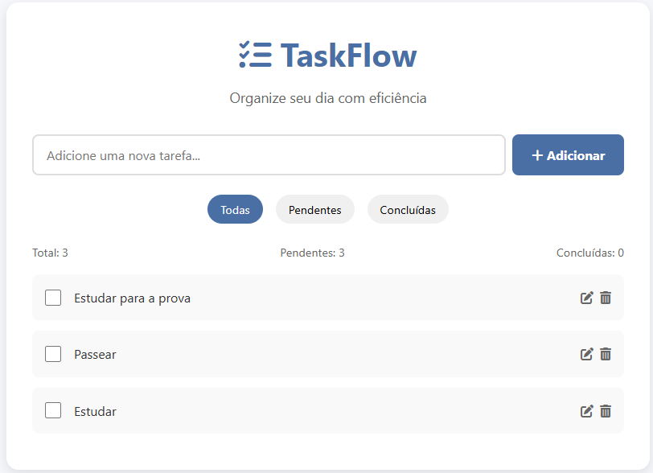

# 📝 TaskFlow - Gerenciador de Tarefas Moderno

 <!-- Adicione uma screenshot real depois -->

**TaskFlow** é um gerenciador de tarefas elegante e responsivo desenvolvido com HTML, CSS e JavaScript puro. Com design moderno e funcionalidades intuitivas, ele ajuda você a organizar seu dia com eficiência.

## ✨ Funcionalidades

- ✅ Adição, edição e remoção de tarefas
- ✅ Marcação de tarefas como concluídas
- ✅ Filtros inteligentes (Todas/Pendentes/Concluídas)
- ✅ Contadores de status em tempo real
- 💾 Persistência de dados com localStorage
- 📱 Design responsivo para todos os dispositivos
- 🎨 Interface moderna com animações suaves
- 🎯 Fácil de usar e personalizar

## 🚀 Como Usar

1. **Adicionar Tarefa**:
   - Digite sua tarefa no campo de texto
   - Pressione Enter ou clique em "Adicionar"

2. **Gerenciar Tarefas**:
   - ✔️ Marque como concluída (clique na checkbox)
   - ✏️ Edite (clique no ícone de lápis)
   - 🗑️ Exclua (clique no ícone de lixeira)

3. **Filtrar**:
   - Use os botões no topo para ver:
     - Todas as tarefas
     - Apenas pendentes
     - Apenas concluídas

## 🛠️ Tecnologias Utilizadas


## 📦 Estrutura do Projeto
taskflow/  
├── index.html # Página principal    
├── style.css # Estilos CSS  
├── script.js # Lógica JavaScript  
├── assets/ # Pasta para recursos  
│ └── screenshot.png # Screenshot do projeto  
└── README.md # Este arquivo  


## 📌 Pré-requisitos

Navegador moderno com suporte a:
- JavaScript ES6+
- CSS Flexbox
- localStorage

## 🛠️ Instalação Local

1. Clone o repositório:
    ```bash
    git clone https://github.com/floresjcd/taskflow.git
    ```
2. Acesse a pasta do projeto:
    ```bash
    cd taskflow
    ```
3. Abra o arquivo index.html no seu navegador.

## 🎨 Personalização

Você pode facilmente customizar o TaskFlow:

1. **Cores**: Edite as variáveis de cor no CSS
    ```css
    .app-header {
        color: #4a6fa5; /* Cor principal */
    }
    ```
2. **Ícones**: Troque os ícones do Font Awesome
    ```html
    <i class="fas fa-tasks"></i> <!-- Ícone padrão -->
    ```

3. **Ícones**: Funcionalidades: Estenda o script.js para adicionar:
+ Prazos para tarefas
+ Categorias
+ Prioridades

## 🤝 Contribuição
Contribuições são bem-vindas! Siga estes passos:
1. Faça um fork do projeto
2. Crie sua branch (git checkout -b feature/nova-feature)
3. Commit suas mudanças (git commit -m 'Adiciona nova feature')
4. Push para a branch (git push origin feature/nova-feature)
5. Abra um Pull Request

## 📄 Licença
Este projeto está licenciado sob a Licença MIT - veja o arquivo LICENSE para detalhes.
<div align="center"> Feito com ❤️ por  José Carlos Flores (https://github.com/floresjcd) </div>